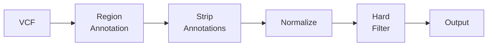

# hardnormly

[](https://github.com/berntpopp/hardnormly/actions/workflows/ci.yml)
[](LICENSE)

VCF normalization and hard filtering toolkit for whole-exome sequencing variant processing.

## Quick Start

```bash
# Install dependencies
conda env create -f conda/hardnormly_environment.yml
conda activate hardnormly

# Run the pipeline
./hardnormly.sh run-pipeline \
  -v input.vcf.gz \
  -f reference.fasta \
  --caller gatk \
  -o output.vcf.gz
```

This normalizes variants (multiallelic splitting, left-alignment) and applies GATK hard filters, writing soft-filter tags to the FILTER column.

## Pipeline at a Glance



See [docs/pipeline.md](docs/pipeline.md) for the full step-by-step breakdown.

## Installation

**Full environment** (standalone CLI with plotting):
```bash
conda env create -f conda/hardnormly_environment.yml
conda activate hardnormly
```

**Minimal** (CLI only, no plots):
```bash
conda create -n hardnormly bcftools bedtools htslib mysql
conda activate hardnormly
```

**CI / apt-get**:
```bash
apt-get install -y bcftools bedtools tabix
```

## Documentation

| Guide | Description |
|-------|-------------|
| [Pipeline](docs/pipeline.md) | Step-by-step pipeline logic with diagram |
| [Options Reference](docs/options.md) | Complete flag reference, categorized |
| [Filters](docs/filters.md) | Filter system, file format, custom filters |
| [Examples](docs/examples.md) | Real-world usage recipes |
| [Snakemake](docs/snakemake.md) | Batch processing with Snakemake |
| [Architecture](docs/architecture.md) | Module structure and development |
| [Filter Definitions](defaults/filters.md) | Detailed GATK and Freebayes filter reference |

## Subcommands

```
hardnormly.sh run-pipeline [options]            # Normalize and filter (default)
hardnormly.sh generate-inclusion-bed [options]   # Merge include BED files
hardnormly.sh generate-exclusion-bed [options]   # Merge exclusion BED files
```

Run `hardnormly.sh --help` or `hardnormly.sh <subcommand> --help` for details.

## License

This project is licensed under the MIT License.
