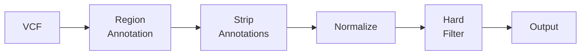

# hardnormly

[](https://github.com/berntpopp/hardnormly/actions/workflows/ci.yml)
[](https://berntpopp.github.io/hardnormly/)
[](LICENSE)

VCF normalization and hard filtering toolkit for whole-exome sequencing variant processing.

## Quick Start

```bash
# Install dependencies
conda env create -f conda/hardnormly_environment.yml
conda activate hardnormly

# Run the pipeline
./hardnormly.sh run-pipeline \
  -v input.vcf.gz \
  -f reference.fasta \
  --caller gatk \
  -o output.vcf.gz
```

This normalizes variants (multiallelic splitting, left-alignment) and applies GATK hard filters, writing soft-filter tags to the FILTER column.

## Pipeline at a Glance



See [docs/pipeline.md](docs/pipeline.md) for the full step-by-step breakdown.

## Installation

**Full environment** (standalone CLI with plotting):
```bash
conda env create -f conda/hardnormly_environment.yml
conda activate hardnormly
```

**Minimal** (CLI only, no plots):
```bash
conda create -n hardnormly bcftools bedtools htslib mysql
conda activate hardnormly
```

**CI / apt-get**:
```bash
apt-get install -y bcftools bedtools tabix
```

## Documentation

Full documentation is available at **https://berntpopp.github.io/hardnormly/**

| Guide | Description |
|-------|-------------|
| [Pipeline](docs/pipeline.md) | Step-by-step pipeline logic with diagram |
| [Options Reference](docs/options.md) | Complete flag reference, categorized |
| [Filters](docs/filters.md) | Filter system, file format, custom filters |
| [Examples](docs/examples.md) | Real-world usage recipes |
| [Snakemake](docs/snakemake.md) | Batch processing with Snakemake |
| [Architecture](docs/architecture.md) | Module structure and development |
| [Filter Definitions](defaults/filters.md) | Detailed GATK and Freebayes filter reference |

## Subcommands

```
hardnormly.sh run-pipeline [options]            # Normalize and filter (default)
hardnormly.sh generate-inclusion-bed [options]   # Merge include BED files
hardnormly.sh generate-exclusion-bed [options]   # Merge exclusion BED files
```

Run `hardnormly.sh --help` or `hardnormly.sh <subcommand> --help` for details.

## Exclusion BEDs

Exclusion BEDs are not committed as defaults. Generate one for the same genome build and contig naming style as your VCF/reference:

```bash
bash scripts/generate_exclusion_bed.sh -b hg19 -o ref/exclude_files/hg19_exclusion.bed -v
bash scripts/generate_exclusion_bed.sh -b hg38 -o ref/exclude_files/hg38_exclusion.bed -v
```

The generator combines ENCODE/Boyle-Lab blacklist regions, UCSC segmental duplications, UCSC RepeatMasker low-complexity regions, and UCSC centromere/telomere intervals.

UCSC sources use `chr` contig names. If your VCF uses `1` instead of `chr1`, create a matching copy:

```bash
sed 's/^chr//' ref/exclude_files/hg38_exclusion.bed > ref/exclude_files/hg38_exclusion_nochr.bed
```

## How to cite

If you use hardnormly, cite the software version used in your analysis. Citation
metadata is available in [CITATION.cff](CITATION.cff), which also enables GitHub's
**Cite this repository** button:

> Popp, Bernt. hardnormly (version 0.7.4). 2026.
> https://github.com/berntpopp/hardnormly/releases/tag/v0.7.4

These metadata describe the latest published release, v0.7.4 (19 February 2026).
A Zenodo DOI has not yet been minted; the release URL is the current citation
target. [.zenodo.json](.zenodo.json) provides matching software metadata for a
future archive.

For future releases, maintainers should:

1. Update the version, release date, and release URL in both metadata files, and
   update the example citation above before creating the corresponding tag.
2. Confirm the authors, affiliations, and ORCIDs, then validate `CITATION.cff`
   with `cffconvert --validate` and check that `.zenodo.json` parses as JSON.
3. Enable the repository in the Zenodo GitHub integration and publish a release
   containing the updated metadata to create an archive.
4. Verify the archive metadata and add the minted DOI and DOI badge to this
   README and the appropriate DOI identifiers to the citation metadata. Use the
   version-specific DOI when citing a particular analysis version.

## License

This project is licensed under the MIT License.
