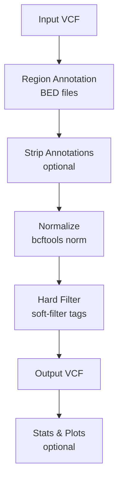

# hardnormly

VCF normalization and hard filtering toolkit for whole-exome sequencing variant processing.

## Quick Start

```bash
conda env create -f conda/hardnormly_environment.yml
conda activate hardnormly

./hardnormly.sh run-pipeline \
  -v input.vcf.gz \
  -f reference.fasta \
  --caller gatk \
  -o output.vcf.gz
```

This normalizes your VCF (multiallelic splitting, left-alignment) and applies GATK hard filters. Variants that fail a filter get a tag in the FILTER column — no variants are removed unless you add `--only-pass`.

## How It Works



See [Pipeline](pipeline.md) for a detailed explanation of each step.

## Documentation

| Guide | What you'll learn |
|-------|-------------------|
| [Pipeline](pipeline.md) | What each step does and why |
| [Options Reference](options.md) | Every flag, categorized by purpose |
| [Filters](filters.md) | Filter system, file format, writing custom filters |
| [Examples](examples.md) | Copy-paste recipes for common workflows |
| [Snakemake](snakemake.md) | Batch processing multiple VCFs |
| [Architecture](architecture.md) | Module structure and development guide |

## Subcommands

| Command | Purpose |
|---------|---------|
| `run-pipeline` | Normalize and filter a VCF (default) |
| `generate-inclusion-bed` | Merge BED files into a combined inclusion region |
| `generate-exclusion-bed` | Merge BED files into a combined exclusion region |

Running `hardnormly.sh` with flags but no subcommand (e.g., `hardnormly.sh -v input.vcf.gz ...`) implicitly routes to `run-pipeline`. Running without any arguments shows help.
