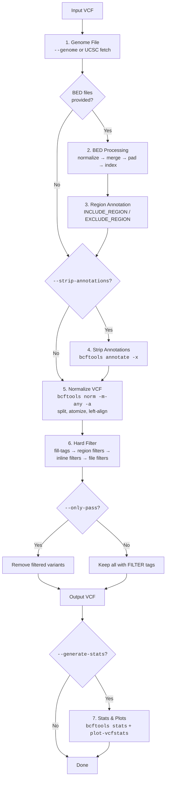
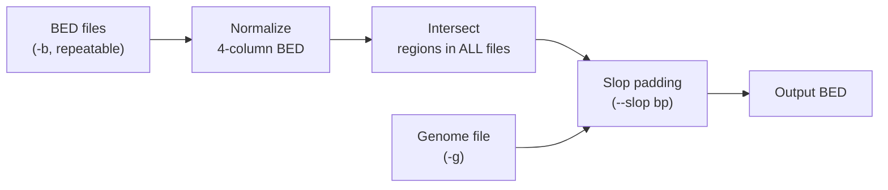

# Pipeline

hardnormly processes a VCF through seven steps. Each step is optional depending on the flags you provide — the only required inputs are a VCF file (`-v`) and a reference FASTA (`-f`).

## run-pipeline

## generate-inclusion-bed

## generate-exclusion-bed

## Step-by-Step Details

## Step 1: Genome File

The genome file lists chromosome names and sizes, needed by `bedtools slop` for region padding.

- **With `--genome`**: Uses the file you provide directly.
- **Without `--genome`**: Queries the UCSC MySQL database for the genome build (default: `hg19`). Override the build with `--genome-build hg38`.

The auto-fetch retries up to 3 times if the UCSC connection fails.

## Step 2: BED Region Processing

If you provide BED files via `--include-bed` or `--exclude-bed`, each goes through:

1. **Normalize** — Standardize to 4-column BED with an annotation label
2. **Merge** — Combine overlapping regions across multiple files
3. **Pad** — Apply `--slop` bp padding (default: 20) using the genome file (inclusion only)
4. **Compress and index** — `bgzip` + `tabix` for fast region lookups

**Inclusion BED** files are intersected (only regions present in all files are kept), then padded. **Exclusion BED** files are unioned (any region in any file is excluded).

## Step 3: Region Annotation

Annotates the VCF with INFO fields based on BED overlap:

| BED Type | INFO Field | Value |
|----------|-----------|-------|
| Inclusion | `INCLUDE_REGION` | `1` if variant falls within an inclusion region |
| Exclusion | `EXCLUDE_REGION` | `1` if variant falls within an exclusion region |

These fields are used downstream in Step 6 to apply region-based filters.

## Step 4: Strip Annotations (optional)

When `--strip-annotations` is provided (e.g., `--strip-annotations INFO/CSQ,INFO/ANN`), the specified INFO fields are removed before normalization. This is useful for stripping VEP or SnpEff annotations that bloat the VCF and interfere with downstream processing.

Uses `bcftools annotate -x` under the hood.

## Step 5: VCF Normalization

Runs `bcftools norm` to:

- **Split multiallelic sites** into biallelic records (`-m-any`)
- **Atomize complex variants** into primitive SNPs and indels (`-a --atom-overlaps .`)
- **Left-align indels** against the reference FASTA

This ensures each variant is represented in a canonical, atomic form before filtering.

## Step 6: Hard Filtering

This is the core step. It applies filters sequentially, tagging variants in the FILTER column.

### fill-tags

Before filtering, `bcftools +fill-tags` computes derived fields:

- `FORMAT/VAF` — Variant allele frequency
- `TYPE` — Variant type (SNP, INDEL, etc.)
- Other standard tags

These tags are available in filter expressions even if the original VCF doesn't include them.

### Filter Application Order

1. **Region filters** — Auto-generated from BED files:
    - `NOT_IN_INCLUDE_REGION` — Tags variants outside inclusion regions
    - `IN_EXCLUDE_REGION` — Tags variants inside exclusion regions
2. **Inline filters** — From `--filters` flags
3. **File-based filters** — From `--filters-file` or `--caller`

Each filter either **excludes** (tags non-matching variants) or **includes** (keeps only matching variants). See [Filters](filters.md) for details.

### Output

By default, all variants are kept with filter tags in the FILTER column. Add `--only-pass` to remove tagged variants, keeping only those marked `PASS`.

## Step 7: Stats and Plots (optional)

When `--generate-stats` is set:

- Runs `bcftools stats` on the output VCF
- Saves the stats file as `<output>.stats.txt`

When `--plot-stats` is also set (requires `--plot-output-dir`):

- Runs `plot-vcfstats` to generate visual summaries
- Plot failures are **non-fatal** — the pipeline continues even if plotting fails (e.g., missing LaTeX dependencies)
